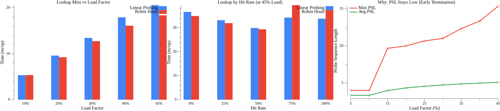
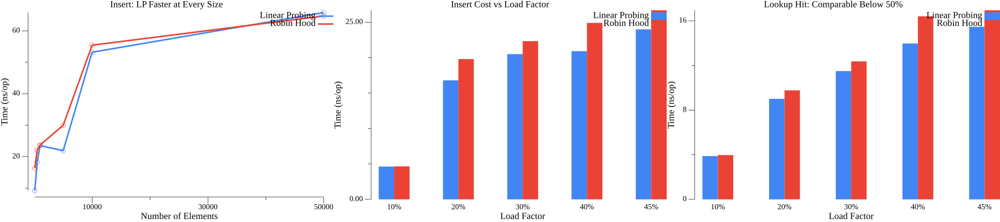

## Robin Hood vs Linear Probing hash tables
The purpose of these experiments is to compare the lookup time of the Robin Hood and Linear Probing implementations of 
Open Addressing hash tables. The Robin Hood hash table is designed to have better performance at high load factors 
which is why the comparison focuses on tests with a high load factor.

#### Contents:
1. [Open Addressing](#open-addressing)
2. [Linear Probing](#linear-probing)
3. [Robin Hood Hashing](#robin-hood-hashing)
4. [Load factor](#load-factor)
5. [Hit rate](#hit-rate)
6. [Linear Probing lookup](#linear-probing-lookup)
7. [Robin Hood lookup](#robin-hood-lookup)
8. [Dataset for comparison](#dataset-for-comparison)
9. [When to choose Robin Hood](#when-to-choose-robin-hood-lookup-misses-are-common-or-operating-at-higher-load-factors)
10. [When to choose Linear Probing](#when-to-choose-linear-probing-insert-performance-is-critical-and-load-factor-stays-below-50)

### Open Addressing
Open Addressing is a type of hash table where collisions are always handled by placing the data somewhere else in the 
already allocated array instead of allocating more memory for the colliding data (for example via a linked list). 
The different ways of handling the collisions is the main difference between different types of Open Addressing hash tables.
Open Addressing is used when memory is limited since there is no extra memory usage to know where the colliding data is located. 
The drawback of Open Addressing is that when the hash table is nearly full then inserting and looking up data in the hash table can
slow down as the time to find an empty spot for the data is increasingly hard as collisions become more common.

### Linear Probing
Linear Probing is the simplest form of Open Addressing where collisions are handled by incrementing the index until an empty 
spot is found for the data. This is very simple to implement but has the problem that the data can easily **start "clumping" 
together at one part of the array due to collisions increasing** the chance of further collisions near the same index. 
When the array is nearly full the performance of inserting and looking up data will decrease since more indexes that already 
contain data have to be skipped over leading to the data being placed far from the original hash index.

### Robin Hood Hashing
Robin Hood Hashing is an extension of Linear Probing that attempts to position the data in the hash tables array **more fairly** 
by keeping track of how far from the intended location the data is placed in the array due to collisions. This distance from the intended
location to where the data is placed is called the **"probe sequence length" (PSL)**. 
When collisions occur while inserting data the algorithm starts out like Linear Probing by simply incrementing the index but 
when the data at the current index has a lower PSL than the amount of times the index has been incremented then the data is swapped
with the data at the current index and the algorithm continues finding a place for the data that was replaced. The PSL can 
then be used to reduce the amount of data that has to be searched through if the data that is being searched for does not exist. 
If the PSL of the data at the current index is lower than the length of the current search then the data can not be in the array
as if it was then the data at the current index would have been replaced by the data that is being searched for. 
This means the search can be stopped early to save time.

### Load Factor
Hash tables have a "Load factor" which is an important variable for Robin Hood hash tables and this means how full the array 
currently is on a scale from 0 to 1. An empty array would have a load factor of 0.0, a half-full array would have a load factor of 0.5,
and a full array would have a load factor of 1.0. A technical description can be found in which describes load factor as 
the "ratio of the number of records stored to the total capacity of the memory.".

### Hit rate
Another variable that can affect performance is the "hit rate" which simply means what percentage of lookups are of keys 
that exist in the hash table. For example if half of all lookups are of keys that exist then the hit rate is 50%, and if 
all lookups are of keys that exist then the hit rate is 100%.

### Linear Probing lookup
The lookup algorithm for Linear Probing calculates a hash from the key and then uses the remainder of dividing the hash 
by the length of the array as the index to start the search. It then compares the key of the node at the current index to 
the key that is being searched for and if the key does not match then the search continues on the next index. If the current 
node does not hold any data then null is returned to signal that no data with the given key exists in the array. If the 
key of the node matches what is being searched for then the data is returned.

```text
Input: key ▷ The identifier of the data

1: h ← hash(key)
2: len ← length of the map
3: index ← h%len
4: i ← 0
5: while i < len do
6:      element_index ← index + i
7:      if element_index ≥ len then
8:          element_index ← element_index − len
9:      end if
10:     n ← node at element_index
11:     if n = null then
12:         return null
13:     end if
14:     if the key of n = key then
15:         return data
16:     end if
17:     i ← i + 1
18: end while
19: return null
```

### Robin Hood lookup
The lookup algorithm for Robin Hood is similar to the one in Linear Probing except that it returns if the **PSL** of the 
current node is smaller than the search length.

```text
Input: key ▷ The identifier of the data

1: h ← hash(key)
2: len ← length of the map
3: index ← h%len
4: i ← 0
5: psl ← 0
6: while i < len do
7:      element_index ← index + i
8:      if element_index ≥ len then
9:          element_index ← element_index − len
10:     end if
11:     n ← node at element_index
12:     if n = null or psl of n < psl then
13:         return null
14:     end if
15:     if the key of n = key then
16:         return data
17:     end if
18:     i ← i + 1
19:     psl ← psl + 1
20: end while
21: return null
```

### Dataset for comparison

The benchmark tests use randomly generated string keys with the format `key_{index}_{random_int64}`. Tests are conducted with:
- **10,000 elements** pre-populated for lookup tests
- **Variable sizes** for insert tests (scales with benchmark iterations)
- **~45% load factor** for high load tests (50% threshold triggers resize)

Run benchmarks with:
```bash
go test ./rhlp -bench=. -benchmem
```

Generate benchmark plots:
```bash
go run ./rhlp/cmd/plotbench ./rhlp/plots
```

### Results

#### When to choose Robin Hood: lookup misses are common or operating at higher load factors



The three charts above explain **why Robin Hood wins when misses dominate or load is high**:

1. **Lookup Miss vs Load Factor** (left): As the table fills up, miss-lookup time grows for both implementations—but Robin Hood stays consistently faster. At 45% load, RH saves ~10% per miss lookup because it can terminate the probe early when it encounters a slot whose PSL is smaller than the current search depth.

2. **Lookup by Hit Rate at 45% Load** (center): At a fixed high load factor, the advantage is most visible when the hit rate is low (0–50%). At 0% hit rate (all misses), the gap is widest. As the hit rate approaches 100% (all hits), both converge because a hit terminates the search at the same point regardless of algorithm.

3. **Why: PSL Stays Low** (right): The mechanism behind the advantage. Although the *maximum* PSL grows steeply with load (red line), the *average* PSL stays remarkably flat (green line, ~5 at 45% load). This means most miss lookups terminate after examining only a handful of slots, whereas Linear Probing must scan until it finds an empty slot—which becomes increasingly rare at high load.

**Takeaway**: If your workload involves frequent lookups for keys that may not exist (cache probes, deduplication checks, membership tests) or your table routinely operates above 30% fill, Robin Hood provides measurably better tail latency.

---

#### When to choose Linear Probing: insert performance is critical and load factor stays below 50%



The three charts above explain **why Linear Probing wins for insert-heavy workloads at moderate load**:

1. **Insert: LP Faster at Every Size** (left): Across table sizes from 100 to 50,000 elements, Linear Probing consistently inserts faster. Robin Hood's "steal from the rich" swapping adds overhead on every collision—each swap requires reading, comparing, and writing back PSL values.

2. **Insert Cost vs Load Factor** (center): Measuring the marginal insert cost at each fill level (the time to insert the last 5% of elements), LP is faster from 20% load onward. The gap widens as load increases because Robin Hood performs more swaps in denser regions of the table.

3. **Lookup Hit: Comparable Below 50%** (right): The tradeoff is worth it—choosing LP for inserts does not sacrifice lookup performance. When the key exists, both implementations find it in comparable time across all tested load factors. There is no penalty for choosing the simpler algorithm.

**Takeaway**: If your workload is insert-heavy (streaming ingestion, batch loading, write-ahead structures) and you keep the load factor below the 50% resize threshold, Linear Probing gives you faster writes with no lookup downside.
